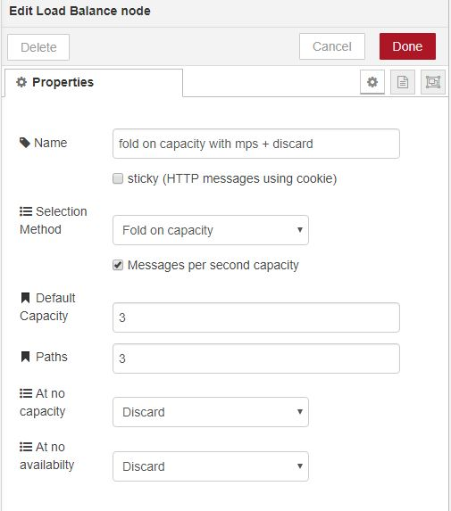

# node-red-contrib-loadbalance  

[Node-Red][1] node to [load balance][2].

Basically spreads input messages to flows based on:
* Round Robin - next in list then start at being again
* Random - randomly across out paths
* Fold on capacity - place load on first node in order with capacity.  Good for improving cache hit ratios 
* Next smoothing to average capacity - next that is >= average capacity to get smoothing of load

This allows incoming messages to be passed to servers that may be other node red instances.

# Management

Messages can be sent to node with the following topics and not forwarded 

## msg.topic loanbalance

Takes in metrics for a path in msg.payload in form:

	{path: <path number>, capacity: <numeric value>} 

or and array of above.

Capacity of zero is considered saturation.  Positive values are expected.

Basically a remote node could be constructed to send a message to update 

## msg.topic loanbalancedebug

Will send metadata about queues to error log so visible in debug console.

## To be done

1. Stop and start a path
* Choice between message discard, queue, random or next when saturation reached 
* Am alive polling, keep alive can be used to trigger remote to send capacity metrics
* Dynamic addition of paths by remote nodes subscribing or discovery
* Some base capacity calls to remote engines 

# Install

Run the following command in the root directory of your Node-RED install

    npm install node-red-contrib-loadbalance

Test/example flow in  test/testflow.json

# Author
  
[Peter Prib][3] 

[id]: url "title"

[1]: http://nodered.org "node-red home page"

[2]: https://www.npmjs.com/package/node-red-contrib-loadbalance "source code"

[3]: https://github.com/peterprib "base github"
