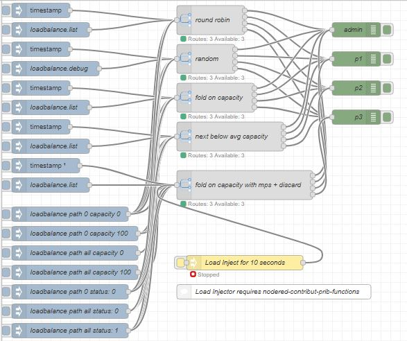
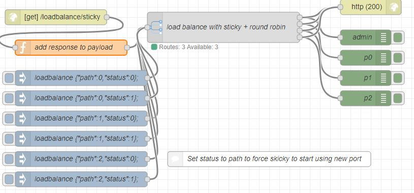

# node-red-contrib-loadbalance  

[Node-Red][1] node to [load balance][2].

Basically spreads input messages to flows based on:
* Round Robin - next in list then start at being again
* Random - randomly across out paths
* Fold on capacity - place load on first node in order with capacity.  Good for improving cache hit ratios. At full capacity random selection.
* Next smoothing to average capacity - next that is >= average capacity to get smoothing of load. At full capacity random selection.

This allows incoming messages to be passed to servers that may be other node red instances.

For HTTP sticky can be selected.  This stores the path in a cookie and the same path is reused so long as it is available and the cookie information is maintained on message.

Out port zero is used for administration and used to send message if there is no availability in all routes.  This allows responses messages or queuing to be managed.

Message per second capacity is visible when capacity based mode is selected.  Indicates capacity is many messages per second are allowed.

Default capacity is visible when capacity based mode is selected.

At no capacity is visible when capacity based mode is selected. Allows choice of what is to be done with message when full capacity is reached.

At no availablity allows  choice of what is to be done with message when there is no availabilty.  Messages either discarded or sent to admin port.

# Management

Messages can be sent to node with the following topics and not forwarded 

## msg.topic loadbalance

Takes in metrics and availablity for a path in msg.payload in form:

	{path: <path number>, capacity: <numeric value>, status: <0=unavailable>} 

or and array of above.

Capacity of zero is considered saturation.  Positive values are expected.

Basically a remote node could be constructed to send a message to update 

## msg.topic loadbalance.list

Will send metadata about queues to admin output port.

## msg.topic loanbalance.debug

Will send metadata about queues to error log so visible in debug console.

## To be done

1. Persist path states and capacity on recycle 
* Am alive polling, keep alive can be used to trigger remote to send capacity metrics
* Dynamic addition of paths by remote nodes subscribing or discovery
* Some base capacity calls to remote engines 
* mps - default base capacity set per path at setup

# Install

Run the following command in the root directory of your Node-RED install

    npm install node-red-contrib-loadbalance

Test/example flow in  test/testflow.json

Test flow for sticky feature in test/testSticky.json

# Author
  
[Peter Prib][3] 

[1]: http://nodered.org "node-red home page"

[2]: https://www.npmjs.com/package/node-red-contrib-loadbalance "source code"

[3]: https://github.com/peterprib "base github"
